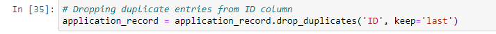

**Credit Card Approval using Machine Learning**

**Abstract:**

**Credit scorecards are a common risk control method in the financial
industry. It uses personal information and data submitted by credit card
applicants to predict the probability of future defaults and credit card
borrowings. The bank can decide whether to issue a credit card to the
applicant. Credit scores can objectively quantify the magnitude of risk.
In general, credit scorecards are based on historical data. Today, due
to the advancement of machine learning algorithms there are many
predictions model such as Boosting, Random Forest, Logistic Regression,
and Support Vector Machines have been introduced into credit card
scoring. Following Business issues will be addressed in this project
using the below-mentioned dataset: Build a machine learning model to
predict whether an applicant is eligible for a credit card, solving an
Unbalanced dataset problem, Analysing the categories important for
credit card eligibility, and comparing the various machine learning
algorithms and their predictions and summarizing in the end.**

1.  **Introduction:**

In recent times, one of the most important transformations taking place
is the shift toward digitalization. One of the sustaining areas where
digitalization has become a trend is in cashless transaction activities.
This has become a very prominent method and more people are inclined
towards cashless transactions as this reduces the risk of misplacing
physical cash. So, many financial institutions across the world are
providing cashless means for their users like debit and credit cards.
One of the most prominent options is having a credit card. Most people
rely on credit cards to perform their transaction activities as it is a
very easy way of making their payments. The private banks rely on
consumer information like their basic info, living standards, salary,
yearly and monthly returns, their current livelihood income source, etc.
All this info is reviewed before processing the application forms with
the bank. This complete check and analysis can help the banks get
through the hassle of enduring the technical / non-technical losses and
the loss of time to both the customers and the banks so that the
concentration is more towards the productive outcomes of both parties. A
proper analysis is required as we see tremendous growth in the financial
sector to avoid any kind of potential risk related to the unethical
consumer.

2.  **Data Set description**

With the above-mentioned scope in our mind, we took an initiative with
this project to analyze how financial institutions can achieve
productivity by taking many variables into our account. The main
objective of the project is to analyze the credit risk criteria by
taking many consumer factors into the consideration. Our goal is to
apply different methodologies to form a strategy that determines if a
consumer is eligible for a loan. To achieve this, we have considered
taking a credit risk proposal dataset from **Kaggle**:
<https://www.kaggle.com/code/advaithmenon14/credit-card-approval-prediction-using-ml/data>

As mentioned before, Credit risk is associated with the possibility of a
client failing to meet contractual obligations, such as mortgages,
credit card debts, and other types of loans. Our datasets from Kaggle
contain two files, application_record.csv containing of over 43000 rows
and 18 columns, and the credit_record.csv detailing the Dependent
variables. Firstly, by understanding the dependent variables given in
the credit_record.csv, we could see that under the STATUS column, the
**STATUS showing as 0** describes that the consumer is 1-29 days past
due for the payment for their credit card. **STATUS 1** describes the
consumer is 30-59 days past due the payment for their credit card.
**STATUS 2** describes the consumer is 60-89 days overdue, **STATUS 3**
describes 90-119 days overdue, **STATUS 4** shows 120-149 days overdue,
and **STATUS 5** shows overdue or bad debts, and write-offs for more
than 150 days. The **STATUS C** details about the paid off that month
and **STATUS X** describes there is no loan for the month. In the
**MONTHS_BALANCE** column, assuming the month of the extracted data as
the starting point, the value 0 is considered to be of the current
month, -1 is of the previous month, and so on.

Hence, based on the details mentioned above, our task is to implement
certain methodologies and the machine learning algorithms on our
Independent Variables in the application_record.csv dataset to validate
how efficiently our machine learning algorithms perform in accessing the
credit risk of the consumers while various factors are taken into
consideration. Our assessment is done based on the IV’s such as the
consumer’s gender, if they own a car, if they own a property, what is
the housing type, their annual income, etc. For more details regarding
each IV, please review it under the Kaggle link above.

3.  **Data Pre-processing:**

As we validated the values under each IV, we could see that the dataset
contained a mixture of both numerical and non-numerical features. The
values are also of different ranges and the dataset had several missing
values. Hence, it is a liability that the data must be pre-processed
before running different machine learning algorithms; so that the
resulting predictions are accurate. After the data is in good shape, we
will perform some explanatory data analysis on this data and build our
intuitions on it. To do so, we have installed some necessary packages as
below:

Note: We accomplished the data pre-processing and EDA using the Jupyter
Notebook.

Once the files are imported and the packages are installed, we will
start with our initial pre-processing of the data.

From the above screen capture, it can be seen that we are initially
validating the null values and then dropping the occupation type record
which contains many null values in it. Then we looked for the duplicate
data in the ID column and dropped the duplicates.

Later we changed the DoB and record containing dates in the form of days
to years for easier assessment.

Also, notice all values in the FLAG_MOBIL are the same, hence dropping
the column.

Now, we are done cleaning the IV dataset. Hence, we move forward by
pre-processing the DV dataset, credit_record.csv. Firstly, we categorize
the 'STATUS' column to binary classification where 0 means the client is
**Eligible** and 1 means the client is **Not Eligible**.

Later we merged both datasets.

We have found it is best to drop the ID column as it has unique values
and not of much value.

After doing Exploratory Data Analysis, we have found the below
conclusion:

1.  Majority of the applications submitted are by females.

2.  Majority of the approved applications are of females.

3.  Majority of the applicants don’t own a car.

4.  Majority of the applicants own a properly/house.

5.  Majority of the applicants don't have any children.

6.  Majority of the applicant’s income lies between 100,000 to 300,000.

7.  Majority of the applicants are working professional.

8.  Majority of the applicants are married.

9.  Majority of the applicants lives in House / Apartment.

We used sklearn package and used LabelEncoder for converting all the
non-numeric columns to numeric ones, we were finally able to get the
cleaned data file.

After complete pre-processing and we found that our dataset is
imbalanced (Approx 85% of the data are eligible condition & 15% of the
data are not eligible) as shown below.

We have addressed this issue in Azure ML (4th Point below)
using SMOTE.

4.  **Analysis of Credit Risk using Machine Learning:**

To make predictions about whether the consumer falls under the risk
category or not by using different machine learning algorithms and
selecting the best-performing model, we are choosing the Azure Machine
Learning Studio to perform the operations.

Firstly, we have created a pipeline where the plan is to use the five
best machine-learning algorithms to make predictions. To do so, we used
the cleaned file. We know that the data is an imbalanced dataset. To
deal with the imbalances, we have used **SMOTE**. SMOTE is used when the
class that we are dealing with is unprecedented. It increases the number
of cases in your dataset in a balanced way. The component works by
generating new instances from existing minority cases that you supply as
input. This implementation of SMOTE does not change the number of
majority cases. The new instances are not just copies of existing
minority cases. Instead, the algorithm takes samples of the feature
space for each target class and its nearest neighbours. The algorithm
then generates new examples that combine features of the target case
with features of its neighbours. This approach increases the features
available to each class and makes the samples more general. Below
mention is the pipeline for our machine-learning model.

Splitting data:

The data was split into test and train. 70% is the train and the rest is
a test. Then we applied the machine learning algorithms.

Tuning MODEL Hyperparameters:

We use hyper tunning module because it lets us control the model
training process. For example, with neural networks, you can decide on
the number of hidden layers and the number of nodes in each layer. Model
performance depends heavily on hyperparameters. Hyperparameter tuning,
also called hyperparameter optimization, is the process of finding the
configuration of hyperparameters that results in the best performance.
The process is typically computationally expensive and manual. Azure
Machine Learning lets you automate hyperparameter tuning and run
experiments in parallel to efficiently optimize hyperparameters.

5.  **Methodology and Results**

We have used the below five Machine learning algorithms to make
predictions:

1.  Two-Class Logistic Regression

2.  Two-Class Boosted Decision Tree Model

3.  Two-Class Decision Forest

4.  Two-Class Support Vector Machine Model

5.  Two-Class Neural Network

We used Random sweep mode in the module and the Maximum number of runs
on the random sweep was 5. We used this because we want to increase
model performance by using the metrics of our choice and simultaneously
conserve computing resources also.

The table below shows several measures for each model that was used to
make predictions.

| Models                    | Accuracy  | AUC       | Precision | Recall    | F1 Score  |
|---------------------------|-----------|-----------|-----------|-----------|-----------|
| Logistic Regression       | 0.633     | 0.693     | 0.65      | 0.618     | 0.636     |
| **Boosted Decision Tree** | **0.891** | **0.936** | **0.914** | **0.872** | **0.892** |
| Decision Forest           | 0.822     | 0.896     | 0.896     | 0.773     | 0.818     |
| Support Vector Machine    | 0.619     | 0.67      | 0.636     | 0.622     | 0.629     |
| Neural Network            | 0.669     | 0.74      | 0.726     | 0.581     | 0.645     |

In our case as we know that the dataset was imbalanced so we can’t just
rely only on the accuracy measures of the model. As per the business
objectives, precision and recall measures are equally important for us
for model comparison. So, we can see that Boosted Decision Tree Model
from the above table is the best model for us, considering the values of
the F1 Score which is nothing but the harmonic mean value of precision
and recall.

**Conclusion**

To conclude, the business challenge of manually reviewing credit card
applications has always been a major concern to management leaders in
the banking domain. This process can be time error-prone and
time-consuming. Obtaining a traditional credit card can take weeks.
There are several steps that must be taken and checks that must be made,
starting with the customer information being verified and ending with
the real credit card approval. Since future clients' information and
missing papers must be tracked, verified, and may arrive in various
formats, these operations are typically manual and frequently not highly
structured. This project proposes ML Models and analyses that can help
the banks get through the hassle of enduring the technical /
non-technical losses and the loss of time to both the customers and the
banks so that the concentration is more towards the productive outcomes
of both parties. A proper analysis is required as we see tremendous
growth in the financial sector to avoid any kind of potential risk
related to the unethical consumer. Also, this project to automate the
process of identifying eligible customers who possess low risk while
issuing credit cards can add a huge value to banking businesses.
